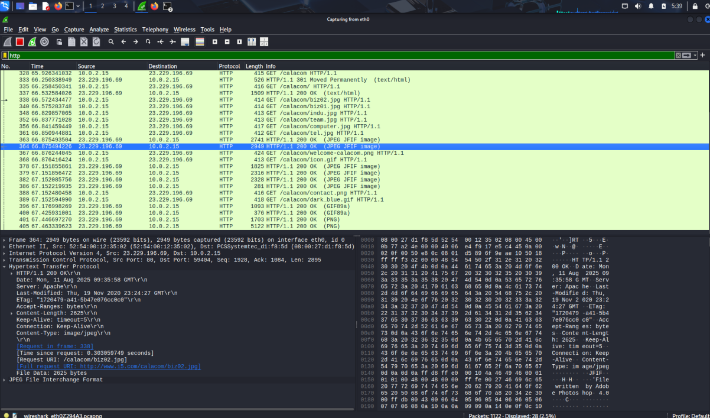

# CyberSecurity_Internship-Elevate_labs-task5
## Project Overview

This project demonstrates network packet capture and analysis using Wireshark to identify protocols and analyse traffic patterns in a controlled environment.

**Objective:** Capture live network packets and identify basic protocols and traffic types using Wireshark.

##  Tools Used

- **Wireshark** (Free network protocol analyzer)
- **VMware Virtual Environment**
- **Firefox Browser** (Traffic generation)

## Executive Summary

Successfully captured and analyzed network packets, identified multiple protocols including `HTTP`, `DNS`, `TCP`, `ICMP` and `ARP`. The analysis revealed critical security vulnerabilities in unencrypted web traffic and demonstrated effective network monitoring techniques.

##  Protocols Identified

### 1. HTTP (Hypertext Transfer Protocol) : Application layer protocol for transferring web pages and data between browsers and web servers.

- **Packets Analyzed:** 12 HTTP requests/responses
  

### 2. DNS (Domain Name System) : System that translates human-readable domain names (like google.com) into IP addresses that computers use.

- **Packets Analyzed:** 10 DNS queries/response
- **DNS Server:** 192.168.1.254
- **Average Response Time:** 6ms

### 3. ARP (Address Resolution Protocol) : Protocol that maps IP addresses to physical MAC addresses on local network segments.

- **Packets Analyzed:** 19 ARP requests/responses
- **Function:** MAC address resolution and network discovery
- **Environment:** VMware virtual network

### 4. ICMP (Internet Control Message Protocol) :  Network diagnostic protocol used for error reporting and network troubleshooting (like ping commands).

- **Packets Analyzed:** ICMP messages
- **Types Observed:** 
  - Echo Request/Reply (ping)
- **Purpose:** Network diagnostics and error reporting

### 5. TCP (Transmission Control Protocol) :  Reliable transport protocol that ensures data is delivered completely and in the correct order between devices.

- **Packets Analyzed:** [Majority of your 1,222 packets]
- **Purpose:** Reliable, connection-oriented transport protocol
- **Key Features:**
  - Three-way handshake connection establishment
  - Sequence numbers for ordered delivery
  - Acknowledgment-based reliability
  - Flow and congestion control
- **Carries:** HTTP, DNS (sometimes), and other application protocols
- **Security Note:** Underlying transport for your HTTP traffic

